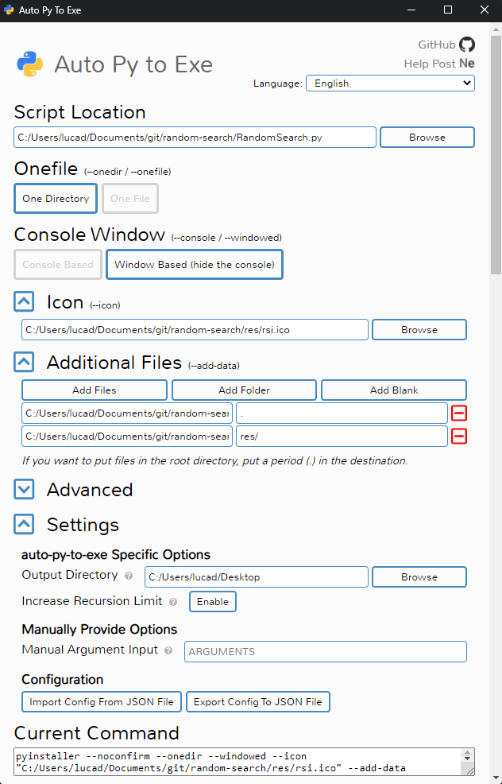

# RandomSearch

## Build from sources

To build RandomSearch yourself on Windows you need to install:

- [Python](https://www.python.org/downloads/) (*pip* is automatically installed with it), checking "*Add Python to PATH*" in the first page of the setup;
- a software like [auto-py-to-exe](https://pypi.org/project/auto-py-to-exe/):

```bash
pip install auto-py-to-exe
```

Install the *Pillow* and *keyboard* libraries through the command `pip install library`.
Download and extract the sources, then use the following command to run auto-py-to-exe:

```bash
auto-py-to-exe
```

Configure it as in the image below. Then click the "*CONVERT .PY TO .EXE*" button.



If at the end of the conversion try you get the following error

```bash
  File "C:\Users\user\AppData\Local\Programs\Python\Python310\Lib\dis.py", line 338, in _get_instructions_bytes
    argval, argrepr = _get_const_info(arg, constants)
  File "C:\Users\user\AppData\Local\Programs\Python\Python310\Lib\dis.py", line 292, in _get_const_info
    argval = const_list[const_index]
IndexError: tuple index out of range

Project output will not be moved to output folder
Complete.
```

you have to go to the folder "C:\Users\user\AppData\Local\Programs\Python\Python310\Lib" and edit the file 'dis.py'. In the 'dis.py' file you have to find this `def _unpack_opargs` and inside the `else` statement write a new line with `extended_arg = 0`, then save the file and try again.

```py
else:
    arg = None
    extended_arg = 0 
yield (i, op, arg)
```
