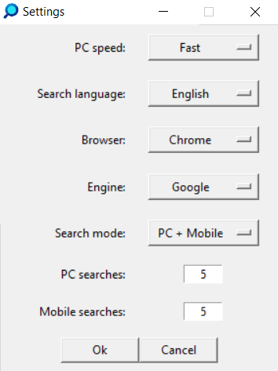
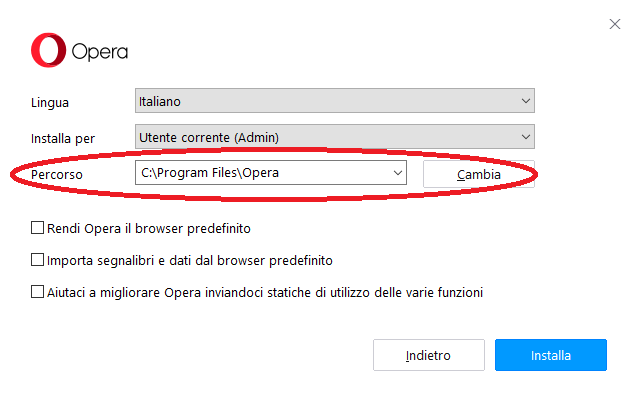
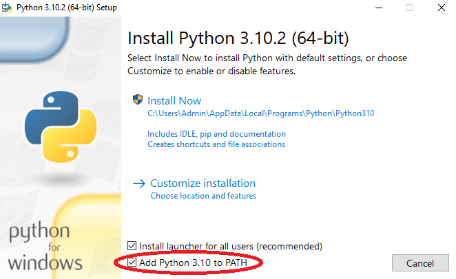
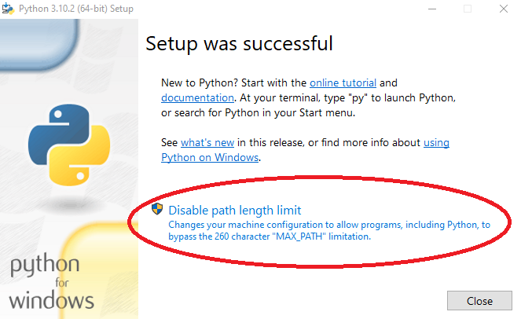

# RandomSearch

RandomSearch is a simple tool that helps you do random searches.  
  
Readme index:
- [How it looks](#how-it-looks)
- [How it works](#how-it-works)
- [Build from sources](#build-from-sources) ([PyInstaller](#1-pyinstaller), [Auto PY to EXE](#2-auto-py-to-exe), [ModuleNotFoundError](#modulenotfounderror))

## HOW IT LOOKS

<p align="center" style="display: flex; justify-content: space-around; flex-wrap: wrap; align-items: center;">
  
  
</p>

## HOW IT WORKS

RandomSearch currently supports four browsers: Chrome, Firefox, Edge and Opera.  
To be able to use it on Opera, the browser must be installed in "C:\Users\username\Program Files\Opera" folder.

<p align="center" style="display: flex; justify-content: space-around; flex-wrap: wrap; align-items: center;">
  
  
</p>

In the settings you can change:
- **PC speed** - (Very Fast, Fast, Slow, Very Slow), to increase/decrease the time between the various operations;
- **Search language** - (English, Italiano), to change the language of the searches;
- **Browser** - (Chrome, Edge, Firefox, Opera);
- **Engine** - (Bing, DuckDuckGo, Ecosia, Google, Yahoo);
- **Search mode** - (PC + Mobile, PC, Mobile), to select the type of the searches;
- **PC searches** and **Mobile searches**, to change the number of the searches.

In order for the tool to work correctly, while it is running you must not remove the focus from the browser.  
Before starting the "mobile" searches for the first time, it is necessary to open the browser's dev tools (*F12*) and enable the mobile device emulation (*Ctrl+Shift+M*). The browser will remember it and the tool will be able to independently set it again. 

## BUILD FROM SOURCES

To build RandomSearch yourself on Windows you need to install [Python](https://www.python.org/downloads/) ([pip](https://pypi.org/project/pip/) is automatically installed with it) selecting "*Add Python to PATH*" and disabling path length limit (see images below).

<p align="center" style="display: flex; justify-content: space-around; flex-wrap: wrap; align-items: center;">
  
  
</p>

To verify that the installation was successful you can run the following commands into the Windows Command Prompt:

```bash
python --version
pip --version
```

If the python one doesn't work, try with:

```bash
py --version
```

If you see a version of Python less than `3.10.0` then is recommended to upgrade your installation.  
Now you need to install through pip two libraries needed for the project to work: `keyboard` and `pillow`.

```bash
pip install keyboard pillow
```

Download and extract on the Desktop the sources. You can now proceed in two ways:

1. via terminal, installing [PyInstaller](#1-pyinstaller).
2. with a GUI, installing [Auto PY to EXE](#2-auto-py-to-exe);

## 1. PyInstaller

> [PyInstaller](https://pypi.org/project/pyinstaller/) bundles a Python application and all its dependencies into a single package. The user can run the packaged app without installing a Python interpreter or any modules.

```bash
pip install pyinstaller
```

Run the following two commands into the Windows Command Prompt (modifying the "*username*"):

```bash
cd Desktop
pyinstaller --noconfirm --onedir --windowed --icon "C:/Users/username/Desktop/random-search-main/res/rsi.ico" --add-data "C:/Users/username/Desktop/random-search-main/utils.py;." --add-data "C:/Users/username/Desktop/random-search-main/config.json;." --add-data "C:/Users/username/Desktop/random-search-main/res;res/"  "C:/Users/username/Desktop/random-search-main/RandomSearch.py"
```

You should now see on the Desktop two folders and a file: *dist*, *build* and *RandomSearch.spec*. You can delete *build* and *RandomSearch.spec* and move the *RandomSearch* folder out of *dist*.

## 2. Auto PY to EXE

> [Auto PY to EXE](https://pypi.org/project/auto-py-to-exe/) is a .py to .exe converter using a simple graphical interface and PyInstaller in Python.

```bash
pip install auto-py-to-exe
```

Use the following command to run Auto PY to EXE:

```bash
auto-py-to-exe
```

Configure it as in the image below, adding the *res* folder and the *utils.py* and *config.json* files in "*Additional Files*".

<p align="center">
  
</p>

Then click the "*CONVERT .PY TO .EXE*" button.  
If at the end of the conversion try you get the following error

```bash
  File "C:\Users\username\AppData\Local\Programs\Python\Python310\Lib\dis.py", line 338, in _get_instructions_bytes
    argval, argrepr = _get_const_info(arg, constants)
  File "C:\Users\username\AppData\Local\Programs\Python\Python310\Lib\dis.py", line 292, in _get_const_info
    argval = const_list[const_index]
IndexError: tuple index out of range

Project output will not be moved to output folder
Complete.
```

you have to go to the folder "C:\Users\username\AppData\Local\Programs\Python\Python310\Lib" and edit the file 'dis.py'. In the 'dis.py' file you have to find this `def _unpack_opargs` and inside the `else` statement write a new line with `extended_arg = 0`, then save the file and try again.

```py
else:
    arg = None
    extended_arg = 0 
yield (i, op, arg)
```

## ModuleNotFoundError

<p align="center">
  
</p>

If trying to run RandomSearch.exe you got the above error, you need to install the mentioned module through pip (as seen before for *keyboard* and *pillow* libraries). Delete the old converted output and start the conversion again.
