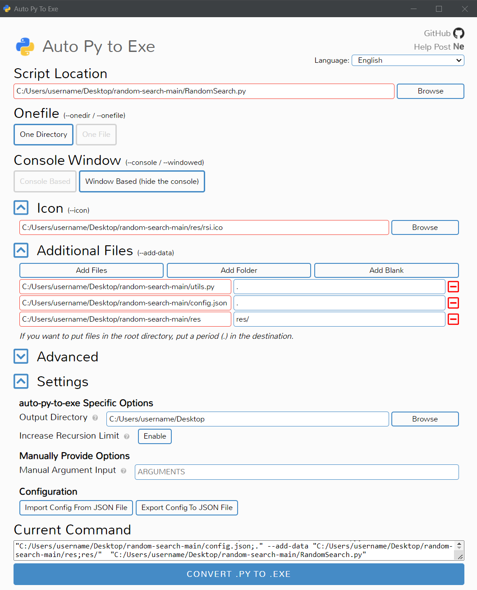

# RandomSearch

## Build from sources

To build RandomSearch yourself on Windows you need to install [Python](https://www.python.org/downloads/) ([pip](https://pypi.org/project/pip/) is automatically installed with it) selecting "*Add Python to PATH*" in the first page of the setup.  
To verify that the installation was successful you can run the following commands into the Windows Command Prompt:

```bash
python --version
pip --version
```

If you see a version of Python less than `3.10.0` then is recommended to upgrade your installation.  
Now you need to install through pip two libraries needed for the project to work: `keyboard` and `pillow`.

```bash
pip install keyboard pillow
```

Download and extract on the Desktop the sources. You can now proceed in two ways:

1. with a GUI, installing [Auto PY to EXE](#1-auto-py-to-exe);
2. via terminal, installing [PyInstaller](#2-pyinstaller).

## 1. Auto PY to EXE

> [Auto PY to EXE](https://pypi.org/project/auto-py-to-exe/) is a .py to .exe converter using a simple graphical interface and PyInstaller in Python.

```bash
pip install auto-py-to-exe
```

Use the following command to run Auto PY to EXE:

```bash
auto-py-to-exe
```

Configure it as in the image below, adding the *res* folder and the *utils.py* file in "*Additional Files*".



Then click the "*CONVERT .PY TO .EXE*" button.  
If at the end of the conversion try you get the following error

```bash
  File "C:\Users\username\AppData\Local\Programs\Python\Python310\Lib\dis.py", line 338, in _get_instructions_bytes
    argval, argrepr = _get_const_info(arg, constants)
  File "C:\Users\username\AppData\Local\Programs\Python\Python310\Lib\dis.py", line 292, in _get_const_info
    argval = const_list[const_index]
IndexError: tuple index out of range

Project output will not be moved to output folder
Complete.
```

you have to go to the folder "C:\Users\username\AppData\Local\Programs\Python\Python310\Lib" and edit the file 'dis.py'. In the 'dis.py' file you have to find this `def _unpack_opargs` and inside the `else` statement write a new line with `extended_arg = 0`, then save the file and try again.

```py
else:
    arg = None
    extended_arg = 0 
yield (i, op, arg)
```

## 2. PyInstaller

> [PyInstaller](https://pypi.org/project/pyinstaller/) bundles a Python application and all its dependencies into a single package. The user can run the packaged app without installing a Python interpreter or any modules.

```bash
pip install pyinstaller
```

Run the following two commands into the Windows Command Prompt (modifying the "*username*"):

```bash
cd Desktop
pyinstaller --noconfirm --onedir --windowed --icon "C:/Users/username/Desktop/random-search/res/rsi.ico" --add-data "C:/Users/username/Desktop/random-search/utils.py;." --add-data "C:/Users/username/Desktop/random-search/res;res/"  "C:/Users/username/Desktop/random-search/RandomSearch.py"
```

You should now see on the Desktop two folders and a file: *dist*, *build* and *RandomSearch.spec*. You can delete *build* and *RandomSearch.spec* and move the *RandomSearch* folder out of *dist*.

## ModuleNotFoundError


If trying to run RandomSearch.exe you got the above error, you need to install the mentioned module through pip (as seen before for *keyboard* and *pillow* libraries). Delete the old converted output and start the conversion again.
